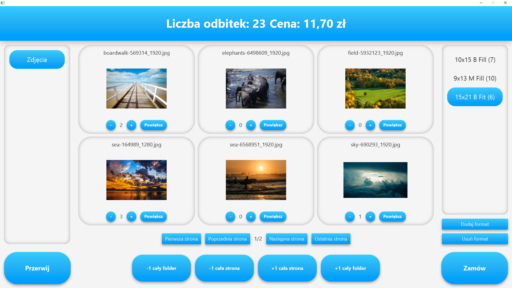
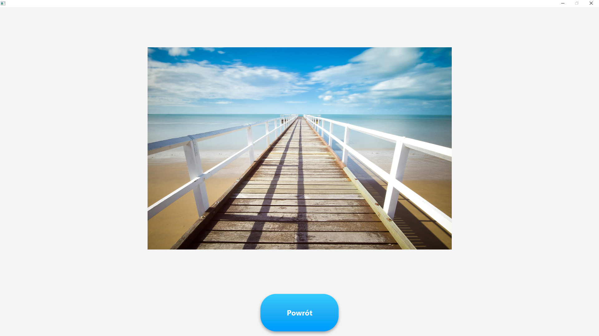

# Opis programu
Aplikacja służąca do przyjmowania zamówień fotograficznych. W momencie utworzenia nowego zamówienia program wyszukuje wszystkie zdjęcia na nośniku zewnętrznym lub w podanej ścieżce na dysku twardym.
Następnie znalezione zdjęcia wyświetlane są na ekranie, gdzie użytkownik ma możliwość wyboru dla każdego zdjęcia:
- ile jego kopii chciałby mieć wydrukowane.
- sposobu kadrowania (pełny papier lub pełny kadr), na jakim papierze (błyszczący lub matowy) oraz w jakim formacie dane zdjęcie ma zostać wydrukowane.

Na końcu zamówienia wybrane zdjęcia kopiowane są do odpowiedniej struktury katalogów na dysku twardym.
Przykładowo zdjęcie o nazwie 1.jpg które zostało zamówione 10 stycznia 2021 (błyszczące, pełny papier, 10x15, 2 sztuki) i jest pierwszym zamówieniem danego dnia, trafi pod ścieżkę:

D:\Zamówienia\10-01-2021\Order_nr_1\10x15\B\Fill\2\1.jpg

Program umożliwia modyfikację:
- ścieżki do katalogu z zamówieniami
- formatów zdjęć wraz z ich cenami (za jedną sztukę)

# Zrzuty ekranu

